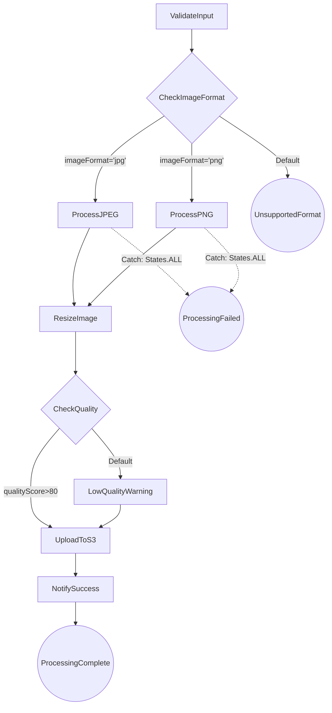
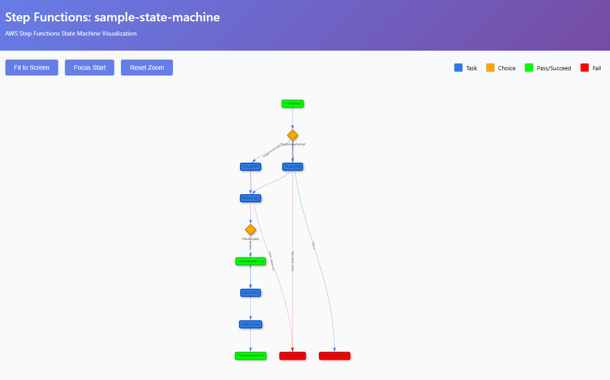

# Step Functions Visualizer

[](https://opensource.org/licenses/MIT)
[](https://claude.ai/code)

Amazon States Language (ASL) JSON定義からMermaid図、インタラクティブなHTML可視化、テキストツリーを生成するAWS Step Functionsステートマシン可視化ツール。

## 機能

✨ **複数の出力形式**
- 📊 **Mermaid図** - Mermaidフローチャートを含むMarkdownファイル（VS Codeプレビュー対応）
- 🌐 **インタラクティブHTML** - ズーム、パン、統計情報を備えたブラウザベースの可視化
- 📝 **テキストツリー** - CLIフレンドリーなASCIIツリー表現

🎨 **ビジュアル強化**
- ステートタイプ別の色分け（Task、Choice、Pass、Fail、Waitなど）
- 遷移と条件を示す明確なエッジラベル
- トップダウン階層レイアウト
- エラーハンドリング（Catch）を破線で表示

🔧 **簡単な統合**
- Claude Code skillとして動作
- スタンドアロンPythonスクリプト
- 自動プロジェクトルート検出
- `images/`ディレクトリへの出力

## インストール

### オプション1: Claude Code Skill（推奨）

1. skillディレクトリをプロジェクトにコピー:
```bash
cp -r stepfunctions-visualizer ~/.claude/skills/
```

2. Claude Codeで使用:
```
/stepfunctions-visualizer path/to/state-machine.json
```

### オプション2: スタンドアロンスクリプト

1. このリポジトリをクローン:
```bash
git clone https://github.com/BanquetKuma/stepfunctions-visualizer.git
cd stepfunctions-visualizer
```

2. 直接実行:
```bash
python3 visualizer.py path/to/state-machine.json
```

## 使い方

### 基本的な使い方

```bash
# すべての形式を生成（Mermaid、HTML、テキスト）
python3 visualizer.py state-machine.json

# 特定の形式を生成
python3 visualizer.py state-machine.json mermaid
python3 visualizer.py state-machine.json html
python3 visualizer.py state-machine.json text
```

### Claude Code Skillとして使用

```
/stepfunctions-visualizer /path/to/state-machine.json
/stepfunctions-visualizer /path/to/state-machine.json mermaid
```

### 出力ファイル

すべての出力はプロジェクトルートの`images/`ディレクトリに保存されます:

```
project-root/
├── .claude/                # プロジェクトマーカー
├── images/                 # 出力ディレクトリ（自動作成）
│   ├── state-machine.md             # Mermaid図
│   ├── state-machine.html           # インタラクティブHTML
│   └── state-machine-tree.txt       # テキストツリー
└── definitions/
    └── state-machine.json           # 入力ファイル
```

## 例

### サンプル入力

画像処理ワークフローの完全な例については、[examples/sample-state-machine.json](examples/sample-state-machine.json)を参照してください。

### Mermaid図の出力

Markdown Preview Mermaid Support拡張機能を使用してVS Codeで表示:



**統計情報:**
- 総ステート数: 12
- 終端ステート: 3 (ProcessingComplete, ProcessingFailed, UnsupportedFormat)
- エラーハンドリングを持つステート: 2 (ProcessJPEG, ProcessPNG)

### インタラクティブHTML可視化

生成されたHTMLファイルをブラウザで開くと以下の機能が利用できます:
- インタラクティブなズームとパン
- 「画面に合わせる」ボタン
- 開始ステートにジャンプする「開始にフォーカス」ボタン
- ステート数を表示する統計パネル
- タイプ別の色分けされたノード

### テキストツリー出力

```
Step Functions Flow Visualization
==================================================

StartAt: Input Validation

Input Validation (Pass)
  └─> Process Task (Task)
    └─> Check Status (Choice)
      ├─[Succeeded]─> Success State (Pass)
      └─[Failed]─> Failed State (Pass)
```

## スクリーンショット

### インタラクティブHTML可視化


## ステートタイプの色分け

| ステートタイプ | 色 | 形状 |
|------------|-------|-------|
| Task | 青 (#2B7CE9) | 長方形 |
| Choice | オレンジ (#FFA500) | ひし形 |
| Pass/Succeed | 緑 (#00FF00) | 長方形 |
| Wait | オレンジ (#FF8C00) | 長方形 |
| Fail | 赤 (#FF0000) | 角丸 |
| Parallel | 紫 (#9370DB) | 長方形 |
| Map | スチールブルー (#4682B4) | 長方形 |

## 要件

- Python 3.7以上
- 外部依存関係なし（標準ライブラリのみ使用）
- Mermaidプレビュー用: Markdown Preview Mermaid Support拡張機能を備えたVS Code
- HTML可視化用: モダンなWebブラウザ（Chrome、Firefox、Safari、Edge）

## 設定

### プロジェクトルート検出

可視化ツールは以下を探してプロジェクトルートを自動検出します:
- `.claude/`ディレクトリ
- `.git/`ディレクトリ

どちらも見つからない場合、出力は入力ファイルの場所を基準に保存されます。

### カスタム出力ディレクトリ

デフォルトでは、出力はプロジェクトルートの`images/`に保存されます。この動作はプロジェクト間の一貫性のためにスクリプトに組み込まれています。

## 開発

以下については[DEVELOPMENT.md](docs/DEVELOPMENT.md)を参照:
- コードアーキテクチャ
- 新しい出力形式の追加
- 可視化のカスタマイズ
- コントリビューションガイドライン

## カスタマイズ

以下については[CUSTOMIZATION.md](docs/CUSTOMIZATION.md)を参照:
- 色とスタイルの変更
- レイアウトパラメータの調整
- カスタムステートハンドラの追加
- テンプレートの変更

## トラブルシューティング

### 循環参照

可視化ツールは循環参照（例：Waitループ）を正しく処理します。エッジは適切な方向性で表示されます。

### 大規模なステートマシン

100以上のステートを持つステートマシンの場合:
- HTML可視化が最適（インタラクティブなズーム/パン）
- テキストツリーは読みにくい可能性があります
- Mermaid図は手動でのレイアウト調整が必要な場合があります

### HTMLでの矢印の欠落

HTML可視化で矢印が欠落している場合は、vis.js設定で`edgeMinimization: false`が設定された最新バージョンを使用していることを確認してください。

## ライセンス

MITライセンス - 詳細は[LICENSE](LICENSE)ファイルを参照してください。

## 謝辞

- AnthropicのClaude Code用に構築
- インタラクティブHTML可視化にvis.jsを使用
- 図の生成にMermaidを使用
- AWS Step Functionsコンソールの可視化にインスパイア

## 関連プロジェクト

- [AWS Step Functions](https://aws.amazon.com/step-functions/)
- [Amazon States Language仕様](https://states-language.net/spec.html)
- [Mermaid](https://mermaid.js.org/)
- [vis.js Network](https://visjs.github.io/vis-network/docs/network/)

## コントリビューション

コントリビューションを歓迎します！プルリクエストをお気軽に提出してください。

1. リポジトリをフォーク
2. フィーチャーブランチを作成（`git checkout -b feature/AmazingFeature`）
3. 変更をコミット（`git commit -m 'Add some AmazingFeature'`）
4. ブランチにプッシュ（`git push origin feature/AmazingFeature`）
5. プルリクエストを開く

## サポート

問題が発生した場合や質問がある場合は、GitHubで[issueを開いて](https://github.com/BanquetKuma/stepfunctions-visualizer/issues)ください。

## 作成者

BanquetKuma
