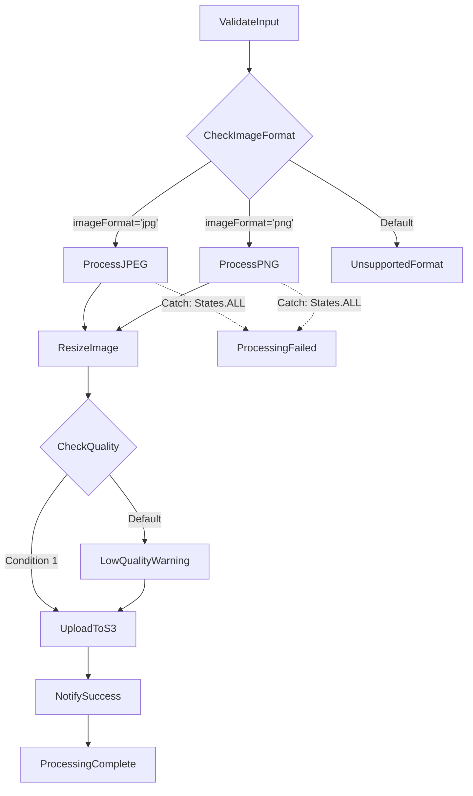

# Step Functions Flow Diagram

## Statistics

- **Total States**: 12
- **Terminal States**: 0
- **States with Error Handling**: 2

### States by Type

- **Choice**: 2
- **Fail**: 2
- **Pass**: 2
- **Succeed**: 1
- **Task**: 5