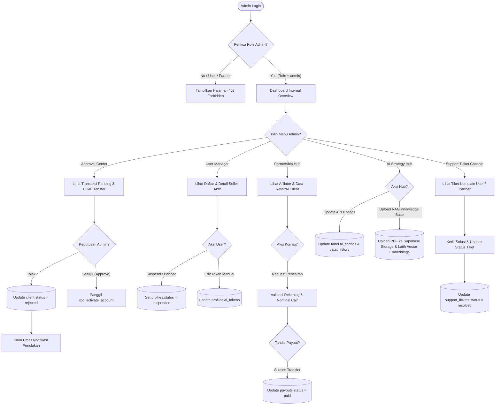

# 📊 Flowchart 3: Operasi Dasbor Internal Admin (End-to-End)

Dokumen ini menjelaskan alur logika dan navigasi kontrol ketika Administrator masuk ke dalam Dashboard Internal (Admin Console) untuk mengontrol ekosistem Tokcer AI.

---

## 1. Visualisasi Alur (Mermaid Flowchart)

---

## 2. Rincian Logika & Aturan Sistem (Jika-Maka)

### 🔒 1. Pemeriksaan Keamanan & Role (RLS Gatekeeper)
* **Jika** session JWT token di browser tidak memiliki `user.role == 'admin'`:
  * **Maka** middleware di Supabase & Frontend memblokir halaman Dashboard Internal secara mutlak dan mengarahkan kembali ke halaman login utama.

### 💰 2. Validasi Pembayaran Manual di Approval Center
* **Jika** admin menyetujui transaksi pendaftaran:
  * **Maka** sistem menjalankan fungsi `rpc_activate_account`. Proses ini wajib beruntun secara transaksi atomik (atomic transaction) di database Supabase guna menghindari kasus akun aktif tanpa terbentuknya rekaman data login.

### 📈 3. Pencatatan Riwayat Perubahan AI Strategy Hub
* Untuk menjamin transparansi perubahan prompt sistem atau API Key:
  * **Jika** Admin mengubah parameter di `ai_configs`:
    * **Maka** nilai lama disalin ke tabel `ai_configs_history` bersama dengan ID Admin yang melakukan perubahan serta stempel waktu (timestamp) kejadian.

### 📚 4. RAG Knowledge Base (Vector Store)
* Saat admin mengunggah berkas PDF panduan jualan UMKM yang baru:
  * Berkas PDF disimpan di bucket Supabase Storage `RAG_KNOWLEDGE`.
  * Sistem memicu background task untuk memecah teks PDF menjadi fragmen-fragmen (text chunking), lalu membuat vector embeddings-nya menggunakan model embedding API, dan menyimpannya di pgvector Supabase. Fragmen ini akan dicari secara relevansi teks setiap kali user menanyakan konsultasi AI.

---
*Dibuat oleh Antigravity Senior Team - Dokumentasi Resmi Tokcer AI*
