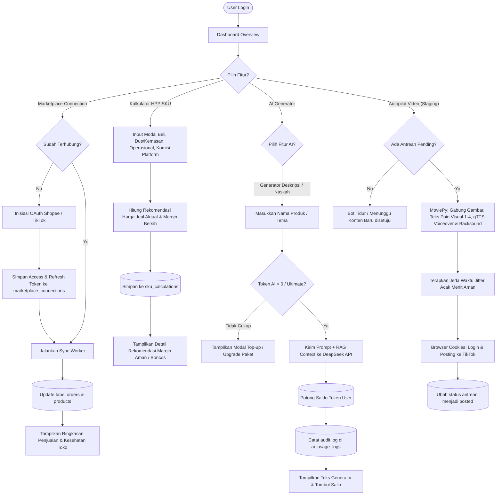

# 📊 Flowchart 2: Operasi Dasbor User / Seller (End-to-End)

Dokumen ini menjelaskan alur navigasi dan logika kerja ketika pengguna (Seller) yang sudah aktif masuk ke dalam Dashboard User untuk menggunakan perkakas optimasi.

---

## 1. Visualisasi Alur (Mermaid Flowchart)

---

## 2. Rincian Logika & Aturan Sistem (Jika-Maka)

### 📊 1. Sinkronisasi Data Marketplace
* **Jika** token koneksi API marketplace kadaluwarsa (`expires_at < NOW()`):
  * **Maka** sistem otomatis mengirimkan *request* pembaruan menggunakan `refresh_token`.
  * Jika refresh token gagal, sistem menandai `sync_status = 'error'` dan meminta pengguna untuk re-otentikasi.

### 💰 2. Logika Penghitungan HPP
* Rumus Kalkulator HPP:
  $$\text{Total HPP} = \text{Modal Beli} + \text{Biaya Kemasan} + \text{Biaya Operasional} + \text{Ongkir Inbound}$$
  $$\text{Harga Jual Aktual} = \text{Harga Jual Marketplace} - \text{Diskon Voucher}$$
  $$\text{Komisi Platform} = \text{Harga Jual Aktual} \times \text{Persentase Komisi Platform}$$
  $$\text{Margin Bersih} = \text{Harga Jual Aktual} - \text{Total HPP} - \text{Komisi Platform} - \text{Biaya Admin Flat}$$
* **Jika** Margin Bersih bernilai negatif (< 0) atau di bawah target margin user:
  * **Maka** aplikasi menampilkan visualisasi status merah (**Boncos/Rugi**) dan merekomendasikan kenaikan harga jual minimum yang disarankan.

### 🤖 3. Validasi Gerbang Token AI
* **Jika** pengguna terdaftar dalam paket `ultimate`:
  * **Maka** pengecekan saldo token diabaikan (dianggap tak terbatas), namun volume token yang dikonsumsi tetap dicatat di tabel audit usage demi memonitor biaya pemakaian API.
* **Jika** pengguna bukan tipe `ultimate` dan saldo tokennya lebih kecil dari perkiraan penggunaan token:
  * **Maka** tombol 'Generate' dinonaktifkan secara dinamis dan modal pemberitahuan sisa koin muncul di layar.

---
*Dibuat oleh Antigravity Senior Team - Dokumentasi Resmi Tokcer AI*
