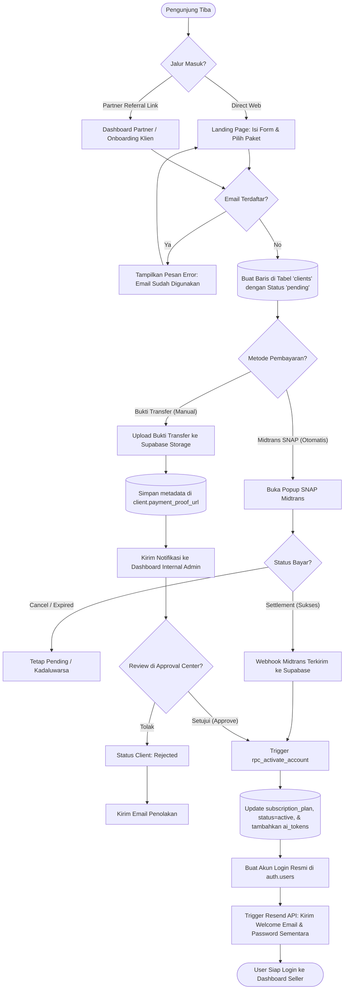

# 📊 Flowchart 1: Pendaftaran, Pembayaran, dan Aktivasi Akun (End-to-End)

Dokumen ini menjelaskan alur logika rinci saat pengguna mendaftar, melakukan transaksi pembayaran (otomatis via Midtrans atau manual via bukti transfer), hingga sistem mengaktifkan akun dan memberikan hak akses.

---

## 1. Visualisasi Alur (Mermaid Flowchart)

---

## 2. Rincian Logika & Aturan Sistem (Jika-Maka)

### 🔗 1. Jalur Onboarding Referal
* **Jika** registrasi melalui link partner (menyertakan referal ID/ref_code):
  * **Maka** sistem mencatat kode referal tersebut di kolom `clients.ref` dan menautkan `clients.partner_id` ke profil partner yang bersangkutan.
  * Komisi partner sebesar persentase yang disepakati akan ditangguhkan hingga status pembayaran berstatus `settlement` atau disetujui admin.

### 💳 2. Otomasi Gerbang Pembayaran Midtrans (SNAP webhook)
Sistem menerima callback notifikasi real-time dari Midtrans:
* **Jika** notifikasi berisi `transaction_status = 'settlement'` atau `transaction_status = 'capture'` (credit card):
  * **Maka** status transaksi diubah menjadi `settlement` di tabel `transactions`.
  * Sistem memanggil fungsi PostgreSQL RPC `rpc_activate_account` secara otomatis.
* **Jika** status `expire`, `deny`, atau `cancel`:
  * **Maka** status antrean diubah menjadi gagal dan lisensi pendaftaran dinonaktifkan.

### 🔑 3. Eksekusi `rpc_activate_account` (Database Sync)
Ketika fungsi RPC dipicu:
1. Mengubah status baris di tabel `clients` menjadi `active`.
2. Menyinkronkan nilai kolom `subscription_plan` di tabel `profiles` sesuai paket yang dipilih (Starter, Pro, Elite, Ultimate).
3. Mengalokasikan saldo awal Koin AI ke `profiles.ai_tokens` (misal: paket Elite mendapatkan 1,000 token).
4. Jika pendaftaran membawa referral, sistem memicu pembagian bagi-hasil komisi partner dan mencatat transaksi pendapatan di tabel ledger komisi partner secara real-time.

---
*Dibuat oleh Antigravity Senior Team - Dokumentasi Resmi Tokcer AI*
