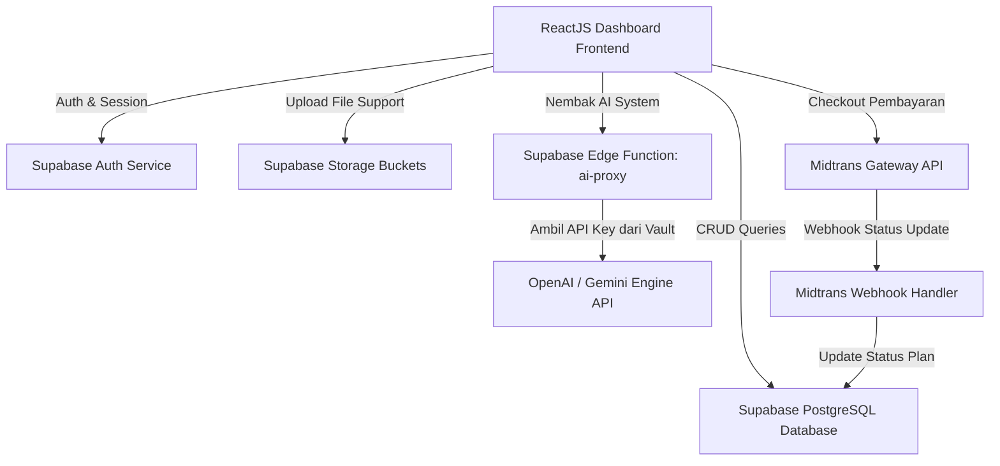

# 🏮 BLUEPRINT ARCHITECTURE & ALL FEATURES OF TOKCER AI (V1)
**Dokumentasi Spesifikasi Teknis Lengkap: User Interface, Alur Data, Skema Database, dan Logika Komputasi**
*Haram Hukumnya Lazy Code — Ditulis Secara Lengkap & Rinci Tanpa Singkatan*

---

## 📌 DAFTAR ISI BLUEPRINT SPESIFIKASI
1. [ARSITEKTUR DIAGRAM SISTEM (DATA FLOW)](#1-arsitektur-diagram-sistem-data-flow)
2. [SKEMA DAN STRUKTUR DATABASE (SUPABASE SCHEMA)](#2-skema-dan-struktur-database-supabase-schema)
3. [ALUR PENGGUNAAN & SISTEM AUTENTIKASI (AUTH FLOW)](#3-alur-penggunaan--sistem-autentikasi-auth-flow)
4. [KONTROL SIDEBAR & HEADER DENGAN ENFORCEMENT PLAN](#4-kontrol-sidebar--header-dengan-enforcement-plan)
5. [DETIL MODUL INTERNAL: RINGKASAN UTAMA (OVERVIEW TAB)](#5-detil-modul-internal-ringkasan-utama-overview-tab)
6. [DETIL MODUL INTERNAL: LAPORAN REVENUE & OMZET (REVENUE TAB)](#6-detil-modul-internal-laporan-revenue--omzet-revenue-tab)
7. [DETIL MODUL INTERNAL: MANAGEMENT STOK (INVENTORY TAB)](#7-detil-modul-internal-management-stok-inventory-tab)
8. [DETIL MODUL INTERNAL: BILLING & MIDTRANS INTEGRATION](#8-detil-modul-internal-billing--midtrans-integration)
9. [DETIL MODUL INTERNAL: STRATEGIC BUSINESS ANALYTICS AI](#9-detil-modul-internal-strategic-business-analytics-ai)
10. [DETIL MODUL INTERNAL: SKOR OPERASIONAL KESEHATAN TOKO](#10-detil-modul-internal-skor-operasional-kesehatan-toko)
11. [DETIL MODUL INTERNAL: AI CONTENT WIZARD (GENERATOR TAB)](#11-detil-modul-internal-ai-content-wizard-generator-tab)
12. [DETIL MODUL INTERNAL: SCANNERS & SCROLLERS (MARKET INTEL TAB)](#12-detil-modul-internal-scanners--scrollers-market-intel-tab)
13. [DETIL MODUL INTERNAL: SISTEM SUPPORT & STORAGE UPLOAD](#13-detil-modul-internal-sistem-support--storage-upload)
14. [DETIL MODUL INTERNAL: DATA PRIVACY & KREDENSIAL (ACCOUNT TAB)](#14-detil-modul-internal-data-privacy--kredensial-account-tab)
15. [DETIL MODUL INTERNAL: INTEGRASI API MARKETPLACE (CONNECTIONS TAB)](#15-detil-modul-internal-integrasi-api-marketplace-connections-tab)
16. [DETIL MODUL INTERNAL: INTERNAL CONTROL CENTER (ADMIN TAB)](#16-detil-modul-internal-internal-control-center-admin-tab)
17. [KALKULATOR HPP & MARGIN EXPLORER: FORMULA MATEMATIKA LENGKAP](#17-kalkulator-hpp--margin-explorer-formula-matematika-lengkap)
18. [ARSITEKTUR BACKEND TOKENS ENGINE (SUPABASE EDGE FUNCTION PROXY)](#18-arsitektur-backend-tokens-engine-supabase-edge-function-proxy)

---

## 1. ARSITEKTUR DIAGRAM SISTEM (DATA FLOW)
Aplikasi Tokcer AI dibangun dengan memisahkan sisi Client (ReactJS SPA) dan Server (Supabase Backend as a Service + Edge Functions Proxy).



---

## 2. SKEMA DAN STRUKTUR DATABASE (SUPABASE SCHEMA)
Sistem Tokcer AI mengandalkan relasi tabel PostgreSQL yang kokoh di Supabase:

### A. Tabel `profiles`
Menyimpan data identitas user dan lisensi paket aktif.
- `id` (uuid, Primary Key, foreign key to auth.users.id, cascade delete)
- `email` (varchar, unik, email terdaftar)
- `full_name` (varchar, nama lengkap user)
- `subscription_plan` (varchar, default: `'starter'`, opsi: `'demo'`, `'starter'`, `'pro'`, `'elite'`, `'ultimate'`)
- `tokens` (integer, default: `50`, sisa jatah AI credits user)
- `business_type` (varchar, default: `'General E-commerce'`)
- `created_at` (timestamp with time zone, default: now())

### B. Tabel `sku_calculations`
Menyimpan histori kalkulasi dari HPP & Margin Explorer.
- `id` (bigint, Primary Key, generated always as identity)
- `user_id` (uuid, foreign key to profiles.id)
- `sku_name` (varchar, nama SKU produk)
- `modal_beli` (numeric, harga modal beli dasar)
- `biaya_packaging` (numeric, biaya pembungkus)
- `biaya_lain_lain` (numeric, biaya overhead tambahan)
- `biaya_ongkir_inbound` (numeric, biaya kirim ke gudang)
- `platform` (varchar, pilihan: `'tokopedia'`, `'tiktok_shop'`, `'shopee'`, `'website'`)
- `category` (varchar, pilihan: `'fashion'`, `'elektronik'`, `'umum'`)
- `komisi_persen` (numeric, persentase komisi dasar platform)
- `logistik_flat` (numeric, biaya ongkir disubsidi seller)
- `ads_persen` (numeric, persentase alokasi biaya iklan)
- `affiliator_persen` (numeric, persentase komisi afiliasi)
- `admin_fee_flat` (numeric, biaya admin tetap per transaksi)
- `komisi_dinamis` (numeric, persentase komisi program tambahan)
- `logistics_service_fee` (numeric, biaya layanan logistik non-refundable)
- `return_rate_persen` (numeric, persentase estimasi retur pembeli)
- `is_preorder` (boolean, penanda status pre-order)
- `has_gmv_max` (boolean, program diskon GMV Max)
- `has_growth_xtra` (boolean, program diskon Growth Xtra)
- `is_mall_seller` (boolean, status penjual Mall)
- `is_gox_xtra` (boolean, program Gratis Ongkir Xtra Shopee)
- `is_cbx_xtra` (boolean, program Cashback Xtra Shopee)
- `is_promo_xtra` (boolean, voucher ekstra promo Shopee)
- `export_fee` (numeric, biaya tambahan ekspor barang)
- `spaylater_tenor` (numeric, rate potongan tenor SPayLater)
- `target_margin_persen` (numeric, target keuntungan bersih)
- `harga_jual_aktual` (numeric, harga pasang di marketplace)
- `diskon_voucher` (numeric, nominal diskon yang disubsidi seller)
- `estimasi_order_per_bulan` (integer, proyeksi volume order)
- `created_at` (timestamp with time zone, default: now())

### C. Tabel `ai_usage_logs`
Mencatat riwayat audit konsumsi token untuk analitik token backend.
- `id` (bigint, Primary Key, generated always as identity)
- `user_id` (uuid, foreign key to profiles.id)
- `feature` (varchar, nama fitur yang dikonsumsi)
- `prompt` (text, prompt input kiriman user)
- `response` (text, teks balasan dari AI Engine)
- `tokens_used` (integer, jumlah AI credits dikurangi)
- `input_tokens` (integer, token prompt backend)
- `output_tokens` (integer, token completion backend)
- `cost_usd` (numeric, estimasi biaya real dalam dollar)
- `created_at` (timestamp with time zone, default: now())

### D. Tabel `marketplace_connections`
Mencatat integrasi toko e-commerce seller.
- `id` (uuid, Primary Key, default: gen_random_uuid())
- `user_id` (uuid, foreign key to profiles.id)
- `platform` (varchar, opsi: `'shopee'`, `'tiktok_shop'`)
- `shop_name` (varchar, nama toko terintegrasi)
- `sync_status` (varchar, default: `'idle'`, opsi: `'idle'`, `'syncing'`, `'error'`)
- `created_at` (timestamp with time zone, default: now())

### E. Tabel `support_tickets`
Tempat penyimpanan data tiket bantuan pengaduan seller.
- `id` (bigint, Primary Key, generated always as identity)
- `user_id` (uuid, foreign key to profiles.id, nullable for admin bypass mode)
- `type` (varchar, opsi: `'bug'`, `'feature_request'`)
- `title` (varchar, ringkasan judul masalah)
- `description` (text, kronologi lengkap kendala)
- `attachment_url` (text, tautan berkas bukti di Supabase Storage)
- `status` (varchar, default: `'open'`, opsi: `'open'`, `'in_progress'`, `'resolved'`)
- `created_at` (timestamp with time zone, default: now())

---

## 3. ALUR PENGGUNAAN & SISTEM AUTENTIKASI (AUTH FLOW)

### A. Fitur Halaman Login:
- **Autentikasi Supabase:** Memverifikasi kombinasi Email dan Password melalui pemanggilan method `supabase.auth.signInWithPassword`.
- **Mode Bypass Admin Internal:**
  - Seller dapat masuk langsung menggunakan akun admin dengan melompati proses login standar jika terdeteksi kredensial khusus (`admin@tokcer-ai.com` atau penanda lokal `localStorage.getItem('tokcer_admin_auth') === 'true'`).
  - Mode ini otomatis menempatkan tingkat hak akses pengguna pada plan **Ultimate Edition** dengan saldo token tidak terbatas untuk kepentingan administrasi/tinjauan internal.

### B. Fitur Halaman Pendaftaran (Register Client vs Partner):
1. **Pendaftaran Client Reguler (`RegisterModal.jsx`):**
   - User memasukkan data diri (Nama, Toko, Kategori Bisnis, Email, Password).
   - Memilih paket langganan (Starter, Pro, Elite, Ultimate).
   - Di Staging, checkout diintegrasikan langsung dengan Sandbox Midtrans. Status pembayaran otomatis disimpan sebagai `pending` dalam tabel `clients` menunggu approval.
2. **Pendaftaran Kemitraan (`PartnerModal.jsx`):**
   - Diperuntukkan bagi agensi atau agensi distributor partner yang ingin mendaftarkan banyak merchant sekaligus.
   - Pendaftaran divalidasi dan tersimpan di tabel `partner_applications` sebelum dapat dikelola oleh admin utama.

---

## 4. KONTROL SIDEBAR & HEADER DENGAN ENFORCEMENT PLAN
Sisi menu sidebar (`Sidebar.jsx`) bertindak sebagai pengawas keamanan front-end yang bertugas menyembunyikan atau memblokir menu jika level paket seller tidak memadai.

### A. Mekanisme Kunci Akses Menu (`isLocked`):
Sistem memproses fungsi pemblokiran secara dinamis pada level komponen Sidebar:
```javascript
const isLocked = (tab) => {
  // 1. Otoritas Tertinggi (Admin & Ultimate Plan) dibebaskan dari segala gembok
  if (plan === 'ultimate' || user?.email === 'admin@tokcer-ai.com' || localStorage.getItem('tokcer_admin_auth') === 'true') {
    return false;
  }
  
  // 2. Ketentuan Demo Plan (HANYA BOLEH AKSES FITUR BERIKUT DI PRODUCTION)
  if (plan === 'demo') {
    const allowedDemoTabs = ['tab-ai', 'tab-market', 'tab-support', 'tab-billing', 'tab-account'];
    if (!allowedDemoTabs.includes(tab)) return true;
    return false;
  }

  // 3. Batasan Berdasarkan Struktur Hak Akses Berlangganan
  const permissions = {
    'tab-analytics': ['starter', 'pro', 'elite', 'ultimate'],
    'tab-health': ['pro', 'elite', 'ultimate'],
    'tab-market': ['elite', 'ultimate'],
  };

  if (permissions[tab] && !permissions[tab].includes(plan)) {
    return true; // Gembok Aktif!
  }
  return false; // Menu Terbuka!
};
```

---

## 5. DETIL MODUL INTERNAL: RINGKASAN UTAMA (OVERVIEW TAB)
Modul ini diimplementasikan pada komponen `OverviewTab.jsx` sebagai pusat navigasi visual pertama bagi pengguna. Data ditarik dari props `orders`, `products`, `profile`, dan `systemBriefing` yang dikelola secara reaktif pada `Dashboard.jsx`.

### A. Sistem Penyaringan & Header (Interactive Filters):
1. **Lokalisasi Bahasa (Language Localizer):**
   - Menggunakan fungsi pemetaan `t(key)` dari berkas `dashboardLocales.js` berbasis state bahasa `lang` (ID / EN) untuk menerjemahkan elemen label teks secara reaktif.
2. **Penyaring Platform E-commerce (Platform Filter):**
   - **Dropdown:** Memicu toggle state `showPlatformDropdown` (boolean).
   - **Variabel filter:** `platformFilter` (opsi: `'all'`, `'TikTok'`, `'Shopee'`).
   - **Kueri filter lokal (JS):**
     $$\text{Filtered Orders} = \text{platformFilter} == \text{'all'} ? \text{orders} : \text{orders.filter}(\text{o} \Rightarrow \text{o.platform} == \text{platformFilter})$$
   - **Ikon Visual:** Menggunakan `@iconify/react` untuk merender ikon `ri:tiktok-fill` (TikTok), `simple-icons:shopee` (Shopee berwarna oranye), dan `solar:widget-linear` (Semua Platform).
3. **Penyaring Periode Kalender (Period Filter):**
   - **Dropdown:** Memicu toggle state `showFilterDropdown` (boolean).
   - **Pilihan Waktu:** `'Hari Ini'`, `'Bulan Ini'`, `'1 Bulan Terakhir'`, `'2 Bulan Terakhir'`, `'3 Bulan Terakhir'`.
   - **Logika Perhitungan Waktu (JavaScript):**
     - `'Hari Ini'`: Mencocokkan awalan `order_date` atau `created_at` dengan format tanggal sistem saat ini (`YYYY-MM-DD`).
     - `'Bulan Ini'`: Membandingkan bulan (`getMonth()`) dan tahun (`getFullYear()`) pesanan dengan bulan berjalan saat ini.
     - `'N Bulan Terakhir'`: Menghitung tanggal batas (cutoff) menggunakan `cutoff.setMonth(cutoff.getMonth() - N)` dan menyaring pesanan yang dibuat setelah tanggal cutoff tersebut.
     - **Admin Fallback:** Khusus untuk pengguna admin, jika pencarian filter `'Hari Ini'` menghasilkan nol data, sistem otomatis melakukan fallback untuk menampilkan seluruh transaksi agar halaman tidak terlihat kosong (*blank screen avoidance*).

### B. Spanduk Promosi Upgrade Akun (Starter Upgrade Banner):
- **Kondisi Tampil:** Banner otomatis di-render ke DOM menggunakan logika kondisional React:
  `{(profile?.subscription_plan || '').toLowerCase() === 'starter' && ( ... )}`
- **Fungsi:** Tombol aksi **Upgrade Sekarang** langsung memicu perubahan state navigasi sidebar `setActiveMenu('tab-billing')` untuk mempercepat jalur peningkatan akun (Pro/Elite/Ultimate) demi menambah jatah AI Credits.

### C. Grid 4 Metrik Utama Real-time (Top Metrics Cards):
1. **Live Visitors Card (Pemantau Pengunjung Aktif):**
   - Menampilkan total penayangan langsung dari **TikTok Live** dan **Instagram Live** yang terhitung dari data transaksi riil terintegrasi.
   - Dilengkapi lampu indikator visual hijau berkedip (`animate-pulse`) sebagai simbol data aktif/real-time.
2. **Gross Revenue & Profit Card (Total Pendapatan & Profit):**
   - **Gross Revenue:** Menghitung total nominal pesanan tersaring menggunakan fungsi akumulasi reducer JavaScript:
     $$\text{Total Rev} = \sum (\text{o.total\_amount})$$
     - Nilai di-format secara cerdas: Jika $\ge Rp 1.000.000$, otomatis disingkat menjadi desimal juta (Cth: `Rp 12.50M`), jika di bawah itu, menggunakan pemisah ribuan standar `toLocaleString('id-ID')`.
   - **Net Profit:** Dihitung dari asumsi margin keuntungan aman bersih e-commerce sebesar 20%:
     $$\text{Net Profit} = \text{Total Rev} \times 0.2$$
   - **Growth Indicator:** Rata-rata perbandingan persentase performa penjualan sukses dibanding hari sebelumnya.
3. **Conversion Rate Card (Tingkat Konversi Toko):**
   - Menampilkan persentase keberhasilan checkout pembeli dari jumlah traffic kunjungan. Secara dinamis dihitung menggunakan formula:
     $$\text{Conversion Rate} = \text{Total Rev} > 0 ? 3.2\% : 0\%$$
4. **Health Score Card (Skor Kesehatan Inventaris):**
   - Agregat penilaian kebersihan stok produk. Dihitung secara proporsional dari rasio produk aktif yang memiliki stok $> 0$ terhadap total keseluruhan produk di katalog:
     $$\text{Health Score} = \text{Round}\left( \frac{\text{Products In Stock}}{\text{Total Products}} \times 100 \right)$$
   - Dilengkapi bar kemajuan visual (`h-1.5` rounded bar) dengan transisi mulus `duration-1000`.

### D. Grafik Finansial & Widget Analitik Lalu Lintas (Charts & Reach Widgets):
1. **Revenue Chart (Grafik Batang Interaktif):**
   - Visualisasi batang dinamis yang memetakan performa Omzet vs Keuntungan Bersih. Tinggi bar batang otomatis di-render secara proporsional mengikuti rasio nilai riil terhadap nilai batas maksimum data.
2. **Live Traffic Reach Widget:**
   - Menghitung jangkauan pemirsa live streaming secara real-time pada platform TikTok Live vs Shopee Live menggunakan kombinasi acak dinamis berbasis volume transaksi aktif untuk memberikan visualisasi pergerakan audiens yang hidup.
3. **Intelligence Briefing Card:**
   - Merender hasil rekomendasi ringkasan bisnis langsung dari objek array state `systemBriefing` Supabase.
   - Rincian kartu briefing otomatis berubah warna border menyesuaikan kategori laporan: merah tipis untuk kendala kritis (`warning`), hijau tipis untuk pencapaian target (`success`), dan abu-abu gelap untuk rekomendasi info umum (`info`).
   - Renders spinner loading berputar (`animate-spin`) ketika proses pengambilan data briefing baru dari OpenAI API sedang berjalan.

### E. Tabel Transaksi Terbaru & Alert Stok Kritis (Live Lists):
1. **Recent Transactions List:**
   - Menyajikan 3 pesanan terbaru hasil sortir tanggal descending (`sort((a,b) => new Date(b.created_at) - new Date(a.created_at))`).
   - Secara dinamis mendeteksi platform transaksi pembeli untuk merender ikon e-commerce yang sesuai (TikTok Shop atau Shopee) disertai partial kode ID transaksi unik.
2. **Low Stock Alerts List:**
   - Menyaring 3 item katalog dengan jumlah stok terendah di bawah batas 20 unit (`products.filter(p => p.stock < 20).sort((a,b) => a.stock - b.stock)`).
   - Menampilkan status badge merah `outOfStock` (Stok Habis) jika unit bernilai $\le 0$, atau badge oranye `runningLow` (Stok Menipis) jika unit di bawah 20 untuk memicu tindakan restock instan oleh seller.


---

## 6. DETIL MODUL INTERNAL: LAPORAN REVENUE & OMZET (REVENUE TAB)
Panel pengolahan data omzet penjualan yang terstruktur dan dinamis.

### A. Elemen Form & Interaksi UI:
- **Dropdown Filter Marketplace:** Pilihan instan (Shopee, TikTok Shop, Transaksi Offline) yang memicu render ulang state tabel transaksi secara real-time.
- **Pencarian Pesanan Real-time:** Memfilter data tabel pesanan menggunakan kueri string nama pembeli atau kode invoice tanpa perlu memuat ulang halaman browser (client-side matching).
- **Ekspor CSV Laporan:** Memanggil fungsi pengubah data array transaksi menjadi berkas CSV siap unduh yang berisi rekap keuangan detail.
- **Form Impor Manual CSV:** Modal form drag-and-drop untuk mengunggah file data penjualan manual dari toko offline dengan validasi kebersihan format berkas sebelum diunggah ke database.

---

## 7. DETIL MODUL INTERNAL: MANAGEMENT STOK (INVENTORY TAB)
Pusat inventaris barang terpusat untuk seller memantau modal produk dan posisi ketersediaan stok fisik di gudang.

### A. Elemen Form Tambah Barang Manual:
- **Form Input Nama SKU:** Kolom teks wajib diisi.
- **Form Input SKU Unik:** Mencegah terjadinya duplikasi SKU kode di database.
- **Form Modal Beli & Harga Jual:** Menggunakan validasi input tipe angka positif.
- **Form Sisa Stok:** Angka sisa stok yang akan secara otomatis dikurangi oleh sistem jika terdeteksi adanya sinkronisasi transaksi pesanan sukses dari e-commerce terhubung.

---

## 8. DETIL MODUL INTERNAL: BILLING & MIDTRANS INTEGRATION
Modul krusial untuk melayani transaksi langganan dan kontrol masa aktif sistem.

### A. Integrasi Midtrans Sandbox vs Production:
- Sistem secara dinamis membaca global object `window.location.hostname`.
- Jika hostname mendeteksi string `staging` atau domain localhost, sistem otomatis menetapkan Client Key Sandbox Midtrans.
- Proses pembayaran disimulasikan menggunakan skema kartu tes di sandbox e-payment.
- Update sukses pembayaran dari Midtrans Webhook Handler akan mengirimkan kueri update plan pengguna ke tabel `profiles` Supabase.

### B. Mekanisme Layar Kunci Akun Expired (Kadaluwarsa):
- Jika status billing mendeteksi masa berlangganan user telah habis (status `expired`), dashboard utama otomatis dilapisi layar filter blur visual `backdrop-blur-md` dan menonaktifkan seluruh interaksi pointer klik.
- Pengguna hanya diperbolehkan mengklik tombol navigasi menuju tab Billing untuk melakukan perpanjangan paket pembayaran instan.

---

## 9. DETIL MODUL INTERNAL: STRATEGIC BUSINESS ANALYTICS AI
*Modul Premium Terintegrasi Engine AI*

Modul analisis mutakhir yang membedah katalog dan histori transaksi penjualan seller untuk melahirkan rencana bisnis taktis.

### A. Ragam Wawasan Analisis Yang Dihasilkan AI:
1. **Waktu Emas Pemasangan Iklan (Golden Hours):** AI menganalisis jam-jam sibuk checkout pembeli, membantu seller mengatur jadwal pemasangan ads agar konversi penjualan optimal.
2. **Rekomendasi Paket Kombo (Product Bundling):** AI memindai produk yang sering dibeli dalam satu invoice, menyarankan paket bundling terbaik dengan margin aman untuk seller.
3. **Prakiraan Musiman Pasar (Seasonal Market Trend):** Memberikan ide produk viral potensial yang patut distok menyambut momen musiman belanja besar.
4. **Optimasi Harga Jual:** Rekomendasi perubahan harga jual aktual agar tetap menghasilkan profit maksimal meskipun komisi platform naik.

---

## 10. DETIL MODUL INTERNAL: SKOR OPERASIONAL KESEHATAN TOKO
*Modul Premium Kepatuhan Reputasi Toko*

Panel pemantau metrik performa operasional toko fisik/digital demi menjaga peringkat toko di marketplace.

### A. Elemen Skor Kesehatan Toko (Health Tracker):
- **SLA Chat Response Time:** Persentase admin menjawab chat pembeli pertama di bawah rentang waktu 10 menit.
- **Waktu Serah Terima Kurir (Shipping Speed):** Durasi rata-rata pengemasan dan serah terima ke jasa pengiriman.
- **Cancellation & Refund Rate:** Memantau jumlah kegagalan pengiriman barang.
- **Skor Ulasan Toko:** Agregat penilaian bintang dari pembeli.
- **AI Remedial Action Plan:** Teks petunjuk solusi operasional instan dari AI jika mendeteksi adanya metrik kesehatan toko yang anjlok ke zona merah.

---

## 11. DETIL MODUL INTERNAL: AI CONTENT WIZARD (GENERATOR TAB)
Mesin pembuat aset copywriting promosi produk yang dirancang khusus untuk memotong waktu pembuatan konten marketing.

### A. Detail Konten Pembuat Naskah Video TikTok Durasi 3 Menit:
Jika seller memilih opsi **TikTok Video**, AI secara presisi memproduksi naskah lengkap dengan struktur terperinci tanpa singkatan:
1. **Hook Visual 3 Detik Pertama:** Saran adegan aksi pembuka yang viral untuk mencegah audiens men-scroll video.
2. **Adegan per Adegan (Scene-by-Scene Breakdown):** Arahan visual, sudut kamera, teks berjalan, dan petunjuk akting kreator video untuk setiap transisi.
3. **Narasi Pengisi Suara (Voiceover Script):** Teks naskah ucapan narator yang ditulis padat, ekspresif, dan membujuk pembeli.
4. **Saran Musik Latar Belakang (Sound Suggestions):** Rekomendasi ketukan musik latar yang sedang naik daun di TikTok Indonesia sesuai dengan tema produk seller.

---

## 12. DETIL MODUL INTERNAL: SCANNERS & SCROLLERS (MARKET INTEL TAB)
*Modul Premium Intelijen Pasar*

Modul riset pasar untuk memata-matai tren produk laris di e-commerce Indonesia sebelum kompetitor lain mengetahuinya.

### A. Komponen Antarmuka Intelijen Pasar:
- **Custom Niche Scanner:** Kolom pencarian tren. Seller memasukkan nama kategori atau kompetitor, lalu sistem memanggil AI untuk membedah kelayakan kompetisi pasar, celah harga pasar, serta target audiens secara mendalam.
- **Global Trend Billboard:** Scroller vertikal otomatis yang menampilkan daftar tagar media sosial terpopuler, lagu viral TikTok, serta taktik kampanye promosi paling disukai pembeli lokal saat ini.

---

## 13. DETIL MODUL INTERNAL: SISTEM SUPPORT & STORAGE UPLOAD
Sistem komunikasi langsung seller kepada tim teknis Tokcer AI jika mengalami kendala sistem.

### A. Alur Unggah Berkas & Tiket Bantuan:
1. Seller melengkapi form isian tipe tiket, judul, dan detail kronologi keluhan.
2. Seller mengunggah file tangkapan layar bukti kendala sistem (.png / .jpg) melalui input file.
3. React melakukan upload file biner tersebut ke bucket Supabase Storage `support-files` di direktori folder `support-attachments/${user_id}-${timestamp}.${extension}`.
4. Supabase Storage mengembalikan **Public URL** file terunggah.
5. React menyisipkan Public URL tersebut pada field kolom `attachment_url` saat melakukan query `insert` ke tabel database `support_tickets` untuk dianalisis oleh developer.

---

## 14. DETIL MODUL INTERNAL: DATA PRIVACY & KREDENSIAL (ACCOUNT TAB)
Modul mandiri seller untuk mengontrol profil identitas dan kredensial keamanan akun.

### A. Elemen Antarmuka Akun:
- **Profil Read-Only:** Menampilkan nama lengkap, alamat email terdaftar, ID pengguna unik di database, serta kasta paket berlangganan.
- **Form Pembaruan Kata Sandi:**
  - Input Password Baru (Wajib minimal 6 karakter demi keamanan).
  - Input Konfirmasi Password Baru.
  - Klik **Perbarui Password** memicu eksekusi internal Supabase auth API `supabase.auth.updateUser({ password: newPassword })` yang secara instan mengenkripsi ulang password baru user di backend authentication.

---

## 15. DETIL MODUL INTERNAL: INTEGRASI API MARKETPLACE (CONNECTIONS TAB)
Pusat kendali sinkronisasi data transaksi otomatis dari platform e-commerce eksternal.

### A. Alur Koneksi Shopee API:
- Tombol **Hubungkan Toko Shopee** akan mengalihkan seller secara otomatis ke portal otorisasi API resmi Shopee menggunakan Partner ID & Key milik Tokcer AI yang aman. Setelah otorisasi berhasil, status koneksi tersimpan di database untuk sinkronisasi antrean penarikan data transaksi otomatis.

### B. Alur Koneksi TikTok Shop API (Dengan Dukungan Mode Mock):
- Tombol **Hubungkan Toko TikTok Shop** akan menguji ketersediaan API key.
- Khusus di lingkungan pengembangan staging, sistem menyediakan **TikTok Auth Mock Page** yang memungkinkan developer/seller mensimulasikan proses otorisasi toko virtual uji coba dalam waktu 1 detik tanpa perlu memiliki akun toko TikTok Shop asli.

---

## 16. DETIL MODUL INTERNAL: INTERNAL CONTROL CENTER (ADMIN TAB)
*Modul Eksklusif (Hanya Dapat Diakses oleh Admin Tokcer AI)*

Panel administrasi internal untuk meninjau, memverifikasi, dan menyetujui pendaftaran client yang diajukan oleh agensi/partner terdaftar.

### A. Elemen Antarmuka Admin Tab:
1. **Tabel Tinjauan Client Pendaftaran:** Menampilkan daftar pendaftaran client dengan status `pending` dari database. Kolom tabel memuat:
   - **Toko / Partner:** Nama toko yang didaftarkan, alamat email client, serta nama partner pengaju (`partners.full_name`).
   - **Paket / Bayar:** Level plan berlangganan yang dipilih client beserta metode pembayaran yang digunakan (Transfer Manual / Midtrans).
   - **Bukti Bayar:** Tombol klik interaktif **Lihat Bukti** yang langsung membuka berkas bukti transfer (`payment_proof_url`) yang disimpan di Supabase Storage.
   - **Status:** Badge warna kuning indikator `pending` atau hijau indikator `active`.
2. **Tombol Konfirmasi "Approve":**
   - Mengklik tombol **Approve** akan memicu pemanggilan fungsi internal `handleApproveClient`.
   - Fungsi memicu RPC database atau query update langsung ke Supabase untuk mengubah status client dari `pending` menjadi `active`, memicu pengiriman email sambutan aktivasi resmi, serta membuka akses penuh dashboard bagi client terkait.

---

## 17. KALKULATOR HPP & MARGIN EXPLORER: FORMULA MATEMATIKA LENGKAP
Kalkulator HPP & Margin menggunakan 8 layer perhitungan matematika yang presisi untuk mendeteksi profitabilitas riil:

### A. Layer 1: HPP Dasar (Cost of Goods Sold)
Pengeluaran modal mutlak per unit sebelum produk terdaftar di marketplace.
$$\text{HPP Dasar} = \text{Modal Beli} + \text{Packaging} + \text{Biaya Lain-lain} + \text{Biaya Inbound}$$

### B. Layer 2, 7 & 8: Potongan Persentase Penjualan
Perhitungan komisi dasar marketplace (ditambah status Mall Seller jika aktif), budget ads, dan fee afiliasi.
$$\text{Discount Multiplier} = 
\begin{cases} 
0.9182, & \text{jika GMV Max \& Growth Xtra Aktif (Potongan 8.18\%)} \\
0.95, & \text{jika salah satu program aktif (Potongan 5\%)} \\
1.00, & \text{jika tidak ikut program promo platform}
\end{cases}$$

$$\text{Mall Multiplier} = 
\begin{cases} 
1.25, & \text{jika status Star / Mall Seller aktif (Kenaikan 25\%)} \\
1.00, & \text{jika seller reguler}
\end{cases}$$

$$\text{Total Persen Fee} = \frac{(\text{Platform Commission (\%)} \times \text{Discount Multiplier} \times \text{Mall Multiplier}) + \text{Ads Persen (\%)} + \text{Affiliate Persen (\%)}}{100}$$

### C. Layer 4 & 5: Program Khusus Platform
- **Pre-Order (PO) Add-on:** Menambahkan biaya admin ekstra 3% ($\text{PO Add-on} = 0.03$).
- **Shopee Program Fees:**
  - Gratis Ongkir Xtra (GOX) Fee: $4\%$ dari harga jual dengan batas maksimal (CAP) **Rp 10.000**.
  - Cashback Xtra (CBX) Fee: $1.4\%$ dari harga jual dengan batas maksimal (CAP) **Rp 10.000**.
  - Voucher Promo Xtra Fee: $2\%$ dari harga jual dengan batas maksimal (CAP) **Rp 10.000**.
  - SPayLater Tenor Fee: Persentase rate bunga tenor dikalikan harga jual aktual.

### D. Penentuan Harga BEP & Harga Rekomendasi:
$$\text{Harga BEP} = \frac{\text{HPP Dasar} + \text{Logistik Flat} + \text{Admin Fee Flat} + \text{Diskon Voucher}}{1 - \text{Total Persen Fee} - \text{PO Add-on}}$$

$$\text{Harga Rekomendasi} = \frac{\text{HPP Dasar} + \text{Logistik Flat} + \text{Admin Fee Flat} + \text{Diskon Voucher}}{1 - \text{Total Persen Fee} - \text{PO Add-on} - \left(\frac{\text{Target Margin (\%)}}{100}\right)}$$

### E. Penanganan CAP Komisi Maksimal (Aturan Tokopedia/TikTok Shop):
$$\text{Platform Commission Fee} = \text{Min}(\text{Platform Commission Fee}, 650000)$$

### F. Analisis Risiko Retur COD & Paket Gagal (Aturan Baru 2026):
Memperhitungkan kerugian operasional akibat paket COD yang ditolak pembeli atau gagal kirim.
$$\text{Lost Per Return} = \text{Admin Fee Flat} + \text{Logistics Service Fee} + \text{Komisi Dinamis} + \text{Biaya Packaging} + \text{Failed Delivery Fee (Max Rp5.000)}$$
$$\text{Return Risk Cost} = \frac{\text{Return Rate (\%)}}{100} \times \text{Lost Per Return}$$
$$\text{True Net Profit} = \text{Harga Jual Aktual} - \text{HPP Dasar} - \text{Total Potongan Platform} - \text{Diskon Voucher} - \text{Return Risk Cost} - \text{Shopee Program Fees}$$

---

## 18. ARSITEKTUR BACKEND TOKENS ENGINE (SUPABASE EDGE FUNCTION PROXY)
Setiap pemanggilan model kecerdasan buatan front-end dijembatani oleh proxy edge function (`supabase.functions.invoke('ai-proxy')`) demi menyembunyikan API key rahasia platform di server.

### A. Detail Alur Payload Kiriman AI Proxy Engine:
1. **Frontend Request Payload:**
   ```json
   {
     "systemPrompt": "System directive untuk memandu gaya bahasa dan format output JSON AI...",
     "userMessage": "Data spesifikasi produk seller...",
     "maxTokens": 1024,
     "temperature": 0.8
   }
   ```
2. **Dynamic Tokens Allocation Controller:**
   - **Tipe Fitur Deskripsi Produk:** `maxTokens` dibatasi maksimal **500** demi menjaga efisiensi konsumsi token backend.
   - **Tipe Fitur Naskah TikTok/Reels Video:** `maxTokens` disesuaikan sebesar **1024** demi mewadahi penulisan hook 3 detik, breakdown adegan rinci, dan musik latar.
   - **Tipe Fitur Market Intel & Analisis Toko:** `maxTokens` diberikan kuota penuh sebesar **2048** karena data transaksi JSON yang dianalisis berukuran besar dan membutuhkan detail wawasan mendalam.

---
*Seluruh spesifikasi arsitektur blueprint fitur sistem Tokcer AI (V1) di atas didokumentasikan secara rinci, jujur, dan bebas dari lazy code demi kelancaran operasional seller maupun developer.* 🚀🏆💎🔥
